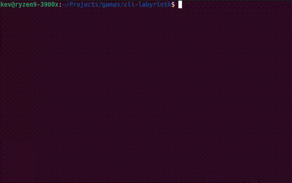

# CLI-Labyrinth

CLI-Labyrinth is a simple maze game that runs on the Linux and MacOS terminal. I created it as a personal learning exercise for both Go programming and terminal development, using the excellent [tcell](https://github.com/gdamore/tcell) Go library.

This is my first attempt at writing a terminal game in Go, so please don't expect guru-level coding here!



## How to Download and Run

You can clone the repo and build the project using Go, but I've also created pre-built binaries for Linux, MacOS and Windows. You can download the required binary from [itch.io](lhttps://yorkshirekev.itch.io/cli-labyrinth).

To play CLI-Labyrinth, simply navigate to the project directory and run the executable in a Linux or macOS shell:

```bash
./cli-labyrinth
```

Please note that you'll need to ensure that the file has the executable flag set.

## Inspiration

CLI-Labyrinth was inspired by the classic 16k Sinclair ZX81 game called Labyrinth, originally written in 1981. If you enjoy maze games, it's worth checking out the original—it's much better than my "modern" version.
